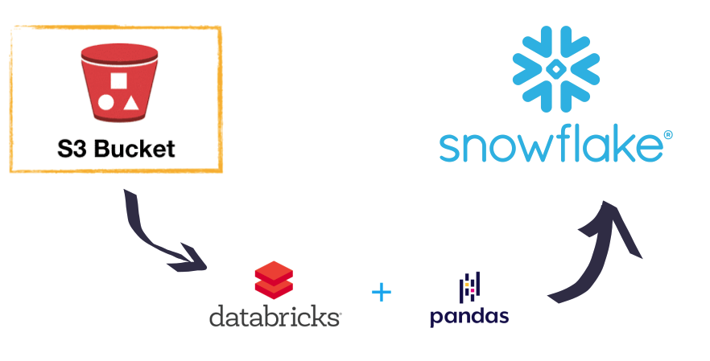

Link to public collab notebook: https://colab.research.google.com/drive/1sZFfyeiSoR6bNTXfg9VRaOte3Kq3boPu?usp=sharing

In order to make the solution scalable I recommend to use tools such as S3 buckets to storage the csv files, databricks to run the process that load the data into the database, and Snowflake as a database. Tools to schedule the workflow such as Oozie or airflow are very helpful.

